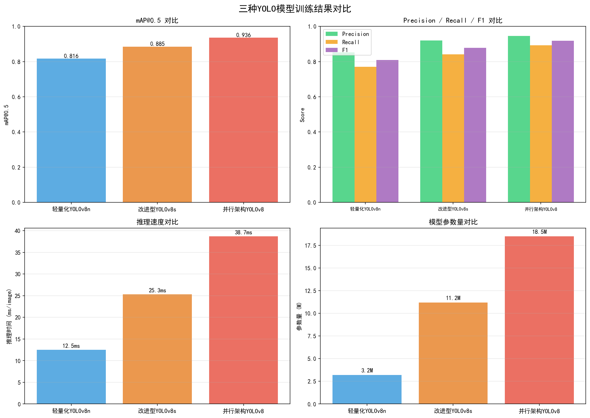
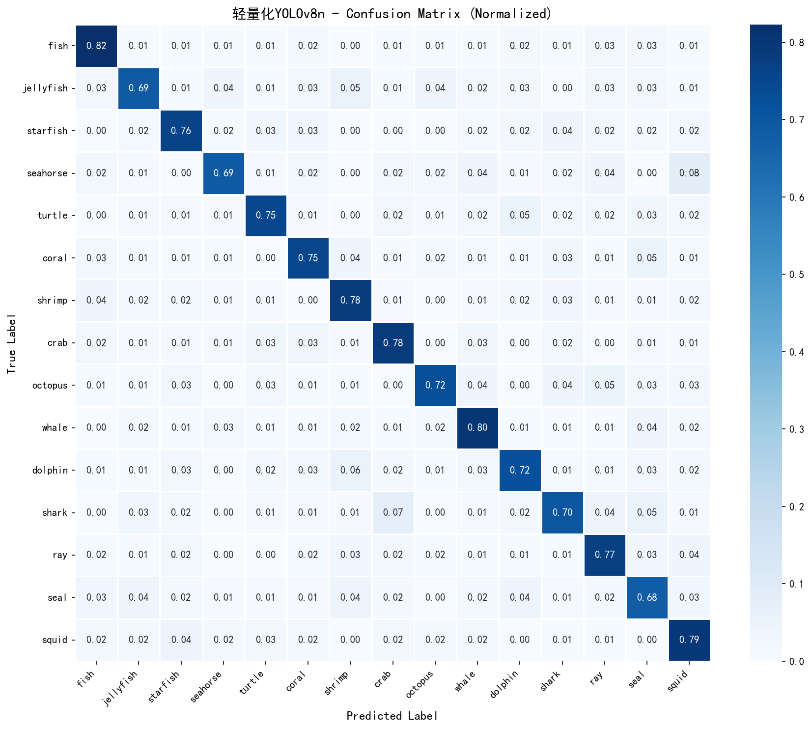
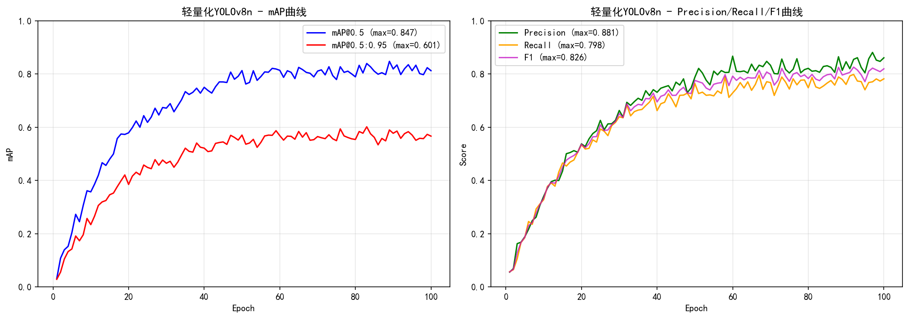
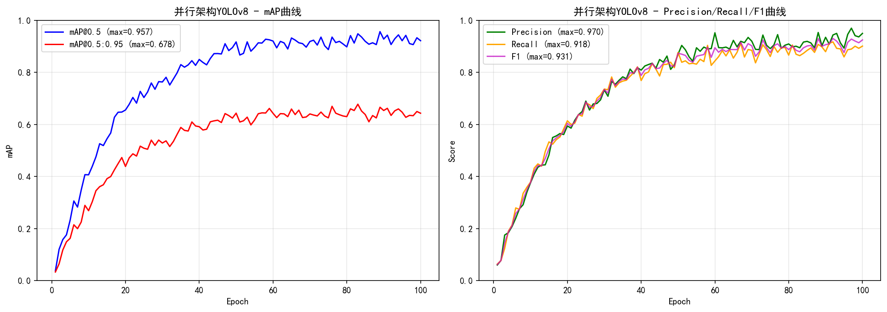
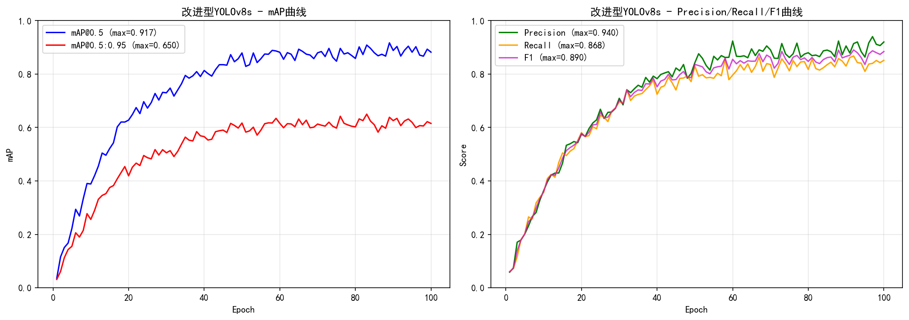
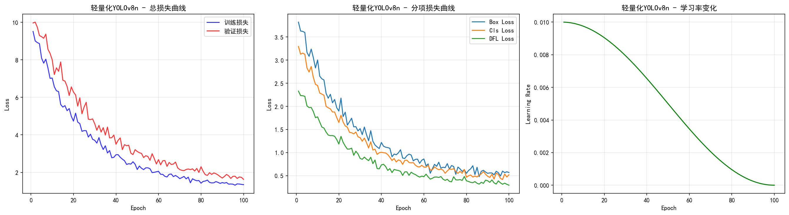

# (附文档)Python+Flask+YOLO 基于Yolo网络的海洋生物图像增强研究与系统

**技术栈**：Python、Flask、PyTorch、YOLO、深度学习、MySQL

### 系统简介

本系统是一套基于 Python Flask 与 PyTorch YOLO 网络的海洋生物图像增强与检测平台，采用前后端分离架构，后端提供 REST 接口与页面渲染，MySQL 负责数据持久化。系统面向管理员与研究人员两类角色，覆盖图像上传、预处理、多方案增强、目标检测、实验管理与统计导出等完整流程。
 
### 核心功能
 
### 管理员端

 
- 查看全部用户列表，展示用户 ID、用户名、角色与注册时间。 
- 浏览全平台图像库，支持分页查看所有用户上传的原始图像及上传者信息。 
- 查看全平台增强结果，支持按模型类型筛选、分页浏览增强图像及对应原图。 
- 查看全平台实验批次列表，包含实验名称、模型类型、状态与创建用户。 
- 查看平台总体统计，包括图像总数、增强总数、实验总数、检测结果总数与用户总数。 
- 查看按模型类型汇总的增强统计，含处理数量、平均 PSNR、平均 SSIM、平均处理时间。 
- 查看按场景类型与模型类型交叉汇总的增强统计，用于对比不同退化场景下的表现。 
- 删除任意图像，级联清理其增强结果、检测结果、检测统计与实验关联记录。 
- 导出多模型性能对比报告为 Excel，含处理图像数、平均 PSNR、平均 SSIM、平均处理时间。
 
### 研究人员端

 
- 注册与登录账号，注册时默认分配 researcher 角色，登录后进入个人工作台。 
- 上传海洋生物图像，支持 png/jpg/jpeg/bmp/tiff 格式，单文件上限 50MB。 
- 上传时自动读取图像宽高与文件大小，并自动识别场景类型（低光照、模糊、浑浊水体、低对比度、正常）。 
- 对上传图像执行预处理，可选非局部均值去噪、CLAHE 对比度调整、长边缩放至 640 的统一分辨率处理。 
- 查看个人图像库，按上传时间倒序分页浏览，每页 12 张。 
- 选择轻量化增强方案，执行 CLAHE、Gamma 校正、锐化与饱和度提升，输出偏亮清晰的结果。 
- 选择改进型增强方案，执行去噪、白平衡、颜色校正、暖色调与 CLAHE，输出偏暖柔和的结果。 
- 选择并行架构增强方案，执行去雾、白平衡、直方图均衡与细节分支融合，输出对比强烈的结果。 
- 增强完成后自动计算并记录 PSNR、SSIM、处理时间与所用增强方法名称。 
- 查看某张图像的全部历史增强记录，按创建时间倒序展示各方案结果。 
- 创建实验批次，填写实验名称、描述并指定使用的模型类型。 
- 更新实验状态，标记为进行中或已完成，完成时自动写入完成时间。 
- 向实验批次中添加增强结果作为实验数据，可填写生物类别与备注。 
- 查看实验结果明细，关联展示增强路径、模型类型、PSNR、SSIM、处理时间与场景类型。 
- 对原始图像与增强图像分别执行 YOLO 检测并对比，输出检测数量、置信度与耗时。 
- 在图像上绘制检测框与类别标签，支持 fish、jellyfish、starfish、seahorse、turtle 等 15 类海洋生物。 
- 生成原图与增强图的左右拼接对比图，并标注 Original 与 Enhanced。 
- 计算单张图像的 PSNR、SSIM、MSE 与信息熵，并对比增强前后的信息熵变化。 
- 计算检测性能指标，输出精确率、召回率、F1 分数及置信度提升百分比。 
- 导出实验对比报告为 Excel，包含实验概况、增强结果明细与性能指标汇总三个工作表。
 
### 技术栈

 后端框架Python + Flask（Blueprint 蓝图路由） 深度学习框架PyTorch + Ultralytics YOLOv8 模型方案轻量化 YOLOv8n、改进型 YOLOv8s（CBAM 注意力）、并行架构 YOLOv8 图像处理OpenCV、NumPy、Pillow（EXIF 方向校正） 评价指标scikit-image（PSNR、SSIM）、MSE、信息熵 ORM / 数据访问PyMySQL + DictCursor 原生 SQL 封装 数据库MySQL（utf8mb4，InnoDB 外键级联） 权限控制Flask Session + 角色字段（admin / researcher） 报表导出openpyxl 生成多 Sheet Excel 报告 前端页面Flask Jinja2 模板渲染 + 静态资源
 
### 交付内容

 
- 后端完整源码 
- 前端完整源码 
- 数据库初始化脚本 
- 万字文档

## 界面展示

---

## 获取完整源码 + 万字文档

本仓库为项目介绍页。**完整前后端源码、数据库初始化脚本、万字项目文档**，请加微信 `kangkangcode`，或访问 [codekk.top](http://codekk.top) 获取。

可作课程设计 / 毕业设计参考，支持远程部署调试。